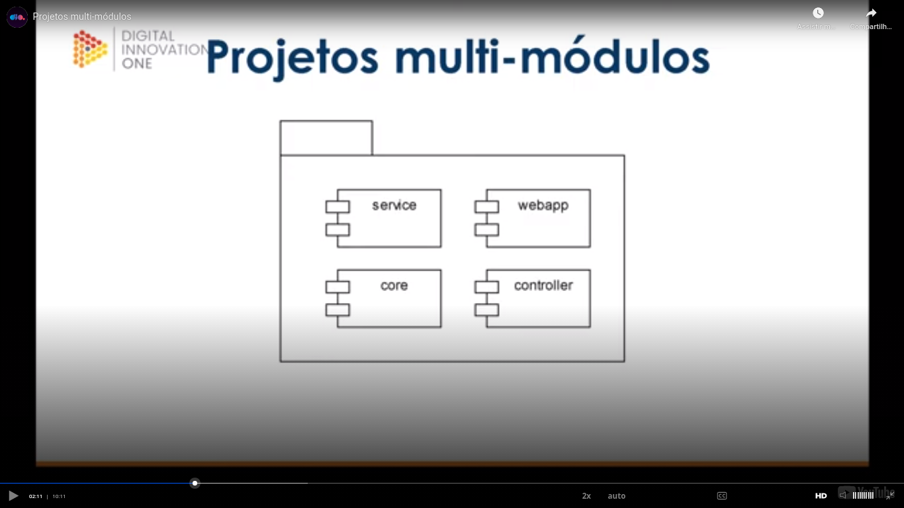
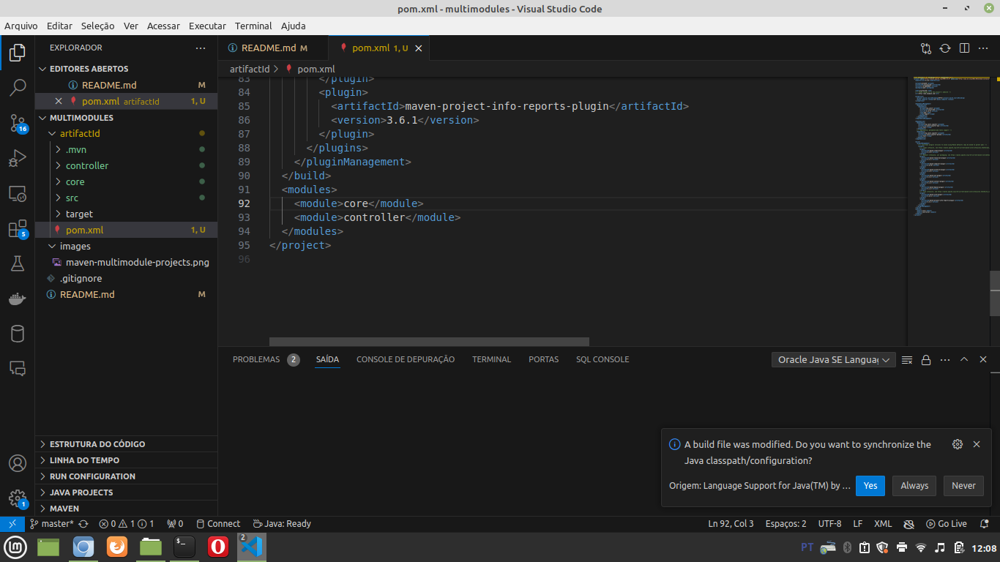
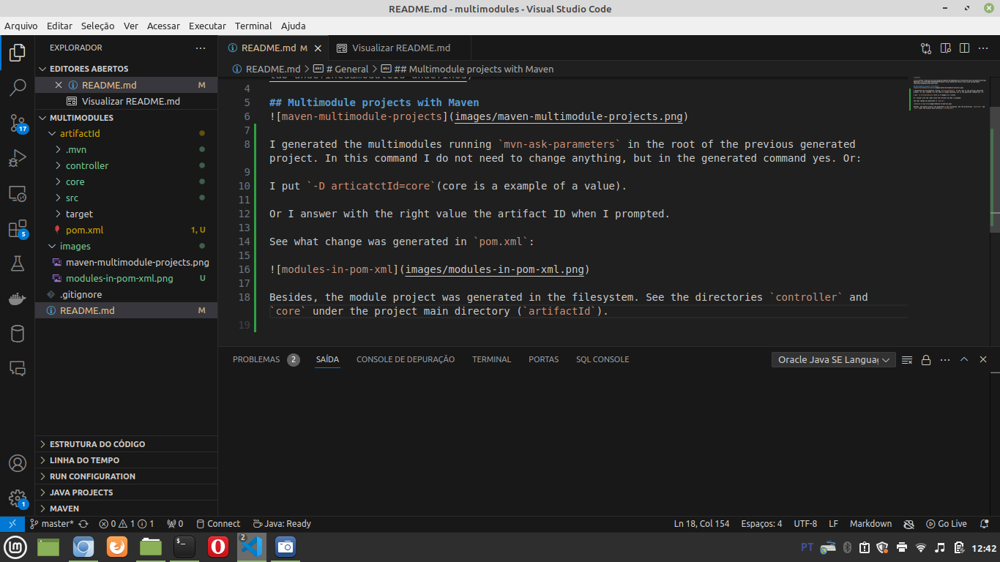
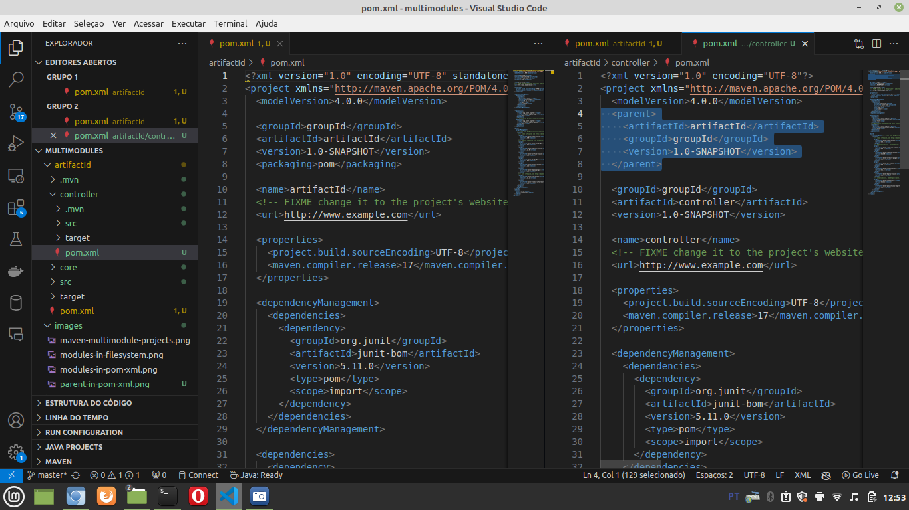

# General

[class](https://web.dio.me/course/gerenciamento-de-dependencias-e-build-em-java-com-maven/learning/9b8187a9-ccc5-47e9-89e8-4783e9ee9f43?back=/track/coding-the-future-claro-java-spring-boot&tab=undefined&moduleId=undefined)

## Multimodule projects with Maven

I generated the multimodules running `mvn-ask-parameters` in the root of the previous generated project. In this command I do not need to change anything, but in the generated command yes. Or:

I put `-D articatctId=core`(core is a example of a value).

Or I answer with the right value the artifact ID when I prompted.

See what change was generated in `pom.xml`:

Besides, the module project was generated in the filesystem. See the directories `controller` and `core` under the project main directory (`artifactId`):

Also you can see that **in the generated module under the main project**, `pom.xml` has a section "`<parent>`". In the next image you can see the main `pom.xml` (without a tag `parent`) and the file `pom.xml` of the generated project (with the tag `parent`).

